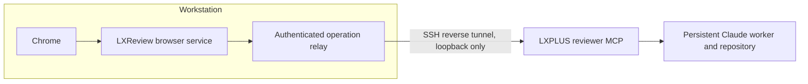
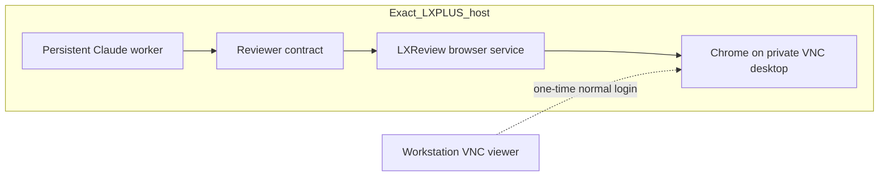

# LXReview

**Independent AI review loops for LXPLUS development.**

```bash
python3 scripts/bootstrap.py
~/.lxreview/bin/lxreview setup --mode lxplus-browser
~/.lxreview/bin/lxreview login
~/.lxreview/bin/lxreview doctor
```

In a new Claude Code conversation:

```text
/review-loop https://github.com/owner/repository/pull/123
```

Without a URL, `/review-loop` reviews the open PR of the current branch (found with the GitHub CLI). The branch must be pushed with an open PR, because the independent reviewer reads the PR on GitHub.

The installer requires `uv` and installs a private Python environment, Playwright and Chrome under `~/.lxreview`. It never modifies shell startup files or PATH. Use the absolute executable path (shown above); `lxreview` below abbreviates that path. No OpenAI API key or credits are used. Claude Code must already be installed and authenticated.

## Two browser placements



Local-browser mode requires the workstation to stay online and awake:

```bash
# On the exact LXPLUS host used by VS Code:
lxreview setup --mode local-browser --role host
lxreview pair
# On the workstation, after bootstrapping there:
lxreview setup --mode local-browser --role workstation
lxreview pair <printed-code>
lxreview login
```

Pairing codes last ten minutes. Relay credentials last at most eight hours; pair again for a new session. SSH authentication uses your existing SSH/Kerberos setup; authenticate interactively first if BatchMode cannot connect. Chrome's debugging protocol is never exposed or forwarded.



LXPLUS-browser mode survives ordinary workstation disconnection, subject to host supervision policy. It cannot survive node reboot/drain. `login` walks you through the SSH tunnel, a VNC viewer and the generated VNC password, then waits until ChatGPT is ready. Every review opens a fresh ChatGPT Temporary Chat, so ChatGPT memory and chat history never carry context between reviews, and review chats do not appear in your ChatGPT history. It skips these steps if you are already logged in. `lxreview desktop connect` prints the steps again, and `lxreview desktop password` shows the password. The password is shown only in an interactive terminal. Never transfer Chrome profiles between users.

## Run lifecycle

```bash
lxreview run https://github.com/owner/repo/pull/123 --repo /path/to/repo
lxreview runs
lxreview status <run-id> --json
lxreview watch <run-id>
lxreview show <run-id> --pass 1
lxreview report <run-id> --output review-report.md
lxreview stop <run-id>
lxreview resume <run-id>
```

After starting a run, `/review-loop` follows it in the same chat: reviewer results, accepted and rejected findings with their reasons, what the worker's Claude says between steps, edits, commands, tests and pushes arrive as they happen. The worker's private reasoning is not shown. Closing the chat stops only the following, never the run. `/review-watch <run-id>` follows a run again from any Claude conversation on the same host, and `/review-status`, `/review-show`, `/review-stop` and `/review-resume` observe and control it. In a terminal, `watch` renders the same timeline (`--raw` prints the redacted JSON events). Ctrl-C stops watching only.

Before each independent review, the working tree must be clean and local HEAD, upstream feature branch and GitHub PR ref must agree (LXReview waits briefly for GitHub to update the PR ref after a push). The worker pushes with an explicit `git push <remote> HEAD:<branch>` to the branch's upstream, so your `push.default` and push refspec settings do not matter. Settings that redirect a push or run extra code (push URLs, URL rewrites, mirror remotes, hook paths, external diff tools) stop the run; `doctor` lists any such global setting. Pushes need an HTTPS GitHub remote with a credential helper; SSH agent/key authentication is unavailable inside the worker sandbox. Every review starts a fresh Temporary Chat in the same managed browser tab. Previous findings are never sent to the reviewer. Claude evaluates substantial findings, edits and tests without network or Git metadata writes, then commits and pushes in a separate restricted turn. The initial test policy supports pytest; other build systems require a policy extension. A push failure stops the run. Final-pass issues produce `MAX_PASSES` without unreviewed edits. An inaccessible or malformed review never counts as success.

State and redacted events live under `~/.lxreview/state/runs/<id>`. Verbatim reviews, explicit evaluations, diffs, test reports and metadata live under the repository's Git common directory, `review-loop/<id>`. Worktrees are supported. Hidden model reasoning is excluded from events. Resume requires a clean, pushed checkpoint; interrupted pass artifacts are retained.

## Operations

`start`, `status`, `stop`, `restart`; `desktop start|stop|status|connect`; `bridge status|stop`; `doctor --json` and `doctor --no-smoke`; `version`; `update`; `cleanup`.

`doctor` performs a real assistant-turn smoke test by default. `--no-smoke` avoids consuming a ChatGPT turn. It never treats a GPU warning alone as browser failure. New MCP registration may require a new Claude conversation. `setup --skip-runtime --skip-integration` is intended for development, not a ready-to-use install.

`update` verifies/reinstalls the current release's pinned browser runtimes; it does not chase latest upstream packages. Application upgrades use `lxreview update --source /path/to/reviewed/checkout`: a frozen private release is smoke-tested before the launcher switches atomically. `lxreview update --rollback` restores the previous launcher. Do not run updates during active reviews.

## Removal

Stop active runs, then run `lxreview uninstall`. Only unchanged LXReview-owned Claude entries and symlinks are removed. The installation root is moved to a private recovery archive whose path is printed; delete it to remove browser state and runtimes completely. Git audit logs are retained and may be removed separately. Shell configuration and unrelated tools are untouched. If the installation folder was deleted by hand instead, rerun `python3 scripts/bootstrap.py`: it recognizes the leftovers and prints the commands that stop any services still running. The following `setup` reuses the existing Claude Code entries, so a later `uninstall` still removes them.

## Development

```bash
uv sync --frozen
uv run pytest
uv run ruff check .
uv run ruff format --check .
uv run mypy src
uv build
```

See [architecture](docs/ARCHITECTURE.md), [security](SECURITY.md), and [third-party notices](THIRD_PARTY.md).

Browser automation is not an official OpenAI, Anthropic or CERN integration. Each user authenticates their own ChatGPT account through normal browser login. UI changes can break automation; no CAPTCHA or MFA bypass is provided.
