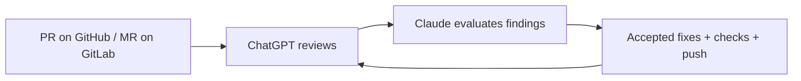

# LXReview

[](https://github.com/jbeirer/lxreview/actions/workflows/ci.yml)
[](https://pypi.org/project/lxreview/)
[](https://pypi.org/project/lxreview/)
[](https://github.com/jbeirer/lxreview/blob/main/LICENSE)

**Independent AI review loops for Claude Code development on any Linux machine: a remote server or cloud VM you reach over SSH, your own workstation, or a shared cluster such as CERN's LXPLUS.**

ChatGPT reviews the actual GitHub PR or GitLab merge request, Claude evaluates and fixes useful findings, and LXReview sends the updated PR through another independent review. The run continues in the background until no accepted substantial issues remain or the pass limit is reached.

LXReview began on LXPLUS and handles its particulars (AFS homes, CVMFS toolchains, Kerberos GitLab remotes), but nothing in it requires CERN: those features switch on only where they apply.

## Why LXReview?

- **Independent review** — ChatGPT reads the PR on GitHub or the MR on GitLab rather than relying on Claude's description of its work.
- **Automatic fix/review loop** — accepted findings can be fixed, checked, committed, pushed and reviewed again, on their own or after you approve each commit or push.
- **Persistent runs** — reviews keep running after you close the Claude chat.
- **Visible decisions** — follow findings, accept/reject reasons, edits, checks, commits and subsequent passes.
- **Uses existing subscriptions** — sign into ChatGPT normally; no OpenAI API key or API credits are required.

## See it in action

In Claude Code, `/review-loop` starts the run with the chosen reviewer and worker models, then relays each step as it happens: the review's findings, which ones Claude accepts or rejects, the fix, and the final result. The run itself continues in the background, so closing the chat does not stop it.


For the full detail, run `lxreview watch <run-id>` in any terminal on the same host. It shows each review pass, every finding with Claude's decision and reason, the commands and checks Claude runs, and the commit it pushes before the next pass. Ctrl-C only stops watching.


Meanwhile, in the background, ChatGPT runs in LXReview's own Chrome. Each pass opens a fresh Temporary Chat, sends the review request and waits for the complete answer, which must end with a verdict. You never need to watch this, but you can: run `lxreview desktop connect` on the host and follow the printed SSH tunnel and VNC viewer steps on your workstation (in local-browser mode, the Chrome window is on your workstation already).


## How it works



The loop finishes when no accepted substantial issues remain, with at most one extra pass of non-blocking fixes (none with [`--substantial-only`](#what-happens-during-a-review)). The final pass reports remaining issues without making edits that would go unreviewed; errors stop the run rather than count as success.

## Quick start

### Prerequisites

- A Linux host where you use Claude Code (a remote server or VM over SSH, your own machine, or a cluster login node such as LXPLUS) and a Git checkout of the project you want reviewed.
- A public repository: ChatGPT reads the PR or MR without signing in, which it cannot do for private or internal projects. GitHub PRs also need the GitHub CLI (`gh`) authenticated with `gh auth login`; GitLab merge requests, on gitlab.com or a self-managed instance such as gitlab.cern.ch, need no extra login.
- A ChatGPT account that can access the PR or MR, and a workstation with SSH and a VNC viewer for the initial browser login.
- About 700 MB free in your home directory for the Python environment and the pinned Chrome (in an AFS home such as LXPLUS, check with `fs listquota ~`).

The host also needs the desktop and sandbox tools checked by `doctor`; see [host requirements](docs/OPERATIONS.md#host-requirements).

If you do not have [uv](https://docs.astral.sh/uv/) and [Claude Code](https://docs.anthropic.com/en/docs/claude-code) yet, install both into `~/.local/bin`, then start `claude` once to sign in:

```bash
curl -LsSf https://astral.sh/uv/install.sh | sh
curl -fsSL https://claude.ai/install.sh | bash
export PATH="$HOME/.local/bin:$PATH"   # add this line to ~/.bashrc to keep it in new shells
claude
```

### Install and log in

Run these on the host where you will work, for example a remote server you reach over SSH:

```bash
uv tool install --managed-python lxreview
lxreview setup --mode host-browser
lxreview login
lxreview doctor
```

In an AFS home such as LXPLUS (small quota, no hard links), add `--no-cache --link-mode=copy` to the install. To install from a checkout, pass its path instead of `lxreview`. If `lxreview` is not found, run `uv tool update-shell`. `setup` installs the pinned Chrome and the Claude Code integration under `~/.lxreview`; `login` walks you through the remote desktop and the ChatGPT sign-in.

To view the browser again later, run `lxreview desktop connect` on the same host. It prints the SSH tunnel and VNC viewer instructions to follow on your workstation; see [reconnecting to the desktop](docs/OPERATIONS.md#reconnect-to-the-desktop).

### Start your first review

Open a **new Claude Code conversation in the project you want reviewed**, with its PR or MR branch checked out and the working tree clean. Replace the example URL with your PR or MR:

```text
/review-loop https://github.com/owner/repository/pull/123
/review-loop https://gitlab.com/group/project/-/merge_requests/123
```

Or, for GitHub, let LXReview find the current branch's PR:

```text
/review-loop
```

The branch must be pushed to its upstream and have an open PR or MR that ChatGPT can open, because it reads the code on GitHub or GitLab. The command returns a run ID and follows progress in the same chat.

## What happens during a review?

1. ChatGPT independently reviews the current PR in a fresh Temporary Chat.
2. Claude evaluates substantial findings and eligible non-blocking findings against the code and PR discussion, including decisions already settled there.
3. Claude runs the project's relevant checks on the unchanged code, implements accepted fixes, then checks again.
4. Claude commits the fixes; LXReview pushes them and asks ChatGPT to review the updated PR. Either step can [wait for your approval](#approving-commits-and-pushes).

These steps repeat until a review leaves no accepted substantial finding, for at most 5 passes. Change the limit for one run with `/review-loop --max-passes 3` (1 to 20), or for every run with [`max_passes`](docs/CONFIGURATION.md#pass-limits-and-timeouts).

To fix only what ChatGPT classifies as substantial, add `--substantial-only`: non-blocking findings are then left alone, and a review with nothing else finishes the run as clean.

New check failures block publication. Pre-existing failures and checks that cannot run are reported. See [review decisions and verification](docs/OPERATIONS.md#review-decisions-and-verification) for the detailed policy.

## Approving commits and pushes

By default the loop commits and pushes accepted fixes on its own. To check them first, have the run wait for your approval before each commit, each push, or both:

```text
/review-loop --push ask                 # commit automatically, ask before each push
/review-loop --commit ask --push ask    # ask before each commit and before each push
```

When the run reaches that step, it pauses and the chat following it asks you. You can also answer from any terminal on the same host:

| The run waits to | What you can inspect | Approve | Decline |
| --- | --- | --- | --- |
| Commit | The checked changes, uncommitted in your checkout | `lxreview approve <run-id> commit` | `lxreview stop <run-id>` |
| Push | One new local commit | `lxreview approve <run-id> push` | `lxreview stop <run-id>` |

`lxreview show <run-id> --pass <n>` shows the pass's findings, diff and checks. Declining stops the run and leaves the changes or the commit to you; to continue reviewing after you push it yourself, run `lxreview resume <run-id>`. Leave the checkout untouched while the run waits, because a commit must contain exactly the checked change. To make approval your default, see [Configuration](docs/CONFIGURATION.md#commits-and-pushes).

## Review only

To review a GitHub PR without changing anything, including someone else's PR, check out its head and add `--review-only`:

```bash
gh pr checkout 123
```

```text
/review-loop https://github.com/owner/repository/pull/123 --review-only
```

ChatGPT reviews the PR once and Claude checks each finding against the code and the PR discussion. The findings Claude accepts become a **pending review** on the PR, created with your `gh` login: inline comments on the affected lines, with a suggested change where the fix is local, and a summary for anything outside the diff. Only you can see a pending review. Open the PR on GitHub to edit or delete comments, then submit or discard the review. LXReview never submits a review, approves or requests changes, and in this mode it neither commits nor pushes.

Review-only runs support GitHub PRs, not GitLab merge requests. See [review-only runs](docs/OPERATIONS.md#review-only-runs) for details.

## Following and controlling a run

**Closing the Claude chat does not stop the review run.** Watch it again from another conversation on the same host, or use the terminal. Ctrl-C in a terminal watch also stops only the watching.

Replace `<run-id>` with the ID returned at startup; `lxreview runs` lists IDs and hosts.

| Task | Claude Code | Terminal |
| --- | --- | --- |
| Follow | `/review-watch <run-id>` | `lxreview watch <run-id>` |
| Check status | `/review-status <run-id>` | `lxreview status <run-id>` |
| Inspect pass 1 | `/review-show <run-id> 1` | `lxreview show <run-id> --pass 1` |
| Approve a waiting commit or push | `/review-approve <run-id> commit\|push` | `lxreview approve <run-id> commit\|push` |
| Stop | `/review-stop <run-id>` | `lxreview stop <run-id>` |
| Resume | `/review-resume <run-id>` | `lxreview resume <run-id>` |

Resume is for failed, cancelled or interrupted runs and requires a clean, pushed checkpoint. Runs survive ordinary disconnection, subject to host policy, but not a host reboot.

### One run at a time

LXReview reviews one run at a time per host, even across repositories: a run keeps the ChatGPT browser for its whole duration, including while Claude evaluates and fixes and while the run waits for your approval. While a run is active, `run` and `resume` refuse and name it. Wait for it to finish, or stop it with `lxreview stop <run-id>`. `doctor` also reports the browser as busy until the run ends.

## Choosing models

Defaults work without configuration. Override model and effort for one run:

```text
/review-loop --chatgpt sol:high --claude opus:xhigh
```

`lxreview options` lists available choices. See [Configuration](docs/CONFIGURATION.md) for persistent defaults, pass limits and custom verification environments.

## Browser modes

Use **`host-browser`** for normal use and persistent runs. It runs the browser on the host where you installed LXReview, behind a private remote desktop you open over SSH only to log in.

| Mode | Best for | Main trade-off |
| --- | --- | --- |
| `host-browser` | Runs independent of your workstation | Browser runs on the host |
| `local-browser` | Keeping the browser on your workstation | Workstation must stay online, awake and connected |

For the alternative mode, run `lxreview setup --mode local-browser --role host` on the host, then follow the [workstation setup and pairing steps](docs/OPERATIONS.md#local-browser). Pairing works with any host your workstation can reach over SSH, including through an SSH config alias or jump host.

## Common commands

| Command | Purpose |
| --- | --- |
| `lxreview doctor` | Check setup and perform a ChatGPT smoke test |
| `lxreview runs` | Find runs and their host |
| `lxreview options` | List model and effort choices |
| `lxreview update` | Upgrade LXReview to the latest release, set it up again and restart its services |
| `lxreview uninstall` | Remove integration and archive the installation |

Run controls are listed above. See [Operations](docs/OPERATIONS.md) for upgrade options, reports and recovery.

## Troubleshooting

- Run `lxreview doctor`; use `--no-smoke` to avoid consuming a ChatGPT turn.
- Check `gh auth status` and ensure your clean, pushed branch matches the PR.
- On AFS (for example LXPLUS), `run` and `resume` require at least two hours of token lifetime; renew with `kinit` followed by `aklog`.
- After setup changes, open a fresh Claude Code conversation to load the integration.

More help: [Operations and troubleshooting](docs/OPERATIONS.md#troubleshooting).

## More documentation

- [Configuration](docs/CONFIGURATION.md)
- [Browser setup and operations](docs/OPERATIONS.md)
- [Architecture](docs/ARCHITECTURE.md)
- [Security](SECURITY.md)
- [Development](docs/ARCHITECTURE.md#development)
- [Third-party notices](THIRD_PARTY.md)

Browser automation is not an official OpenAI, Anthropic or CERN integration. UI changes can break it; each user logs in normally, with no CAPTCHA or MFA bypass.
