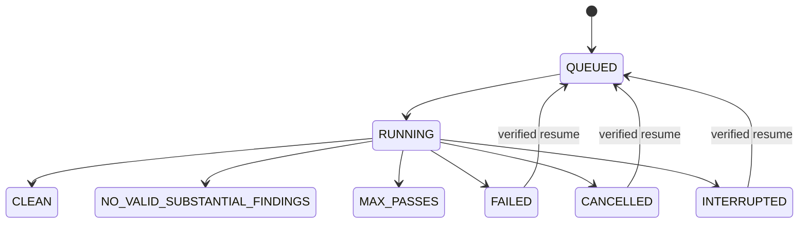

# Architecture

`contracts.py` owns normalized requests, responses, health, reviewer and browser-session protocols. `worker.py` owns the provider-neutral review loop. `reviewer.py` owns independent review semantics. `browser/playwright.py` owns the ChatGPT page driver: every selector, the page-state script, prompt readback, submission and completion rules. `browser/service.py` runs that driver in a supervised process that owns Chrome and serves the named operations on a private unix socket. `backend.py` is the composition root; neither workflow prompts nor worker logic branch on browser placement.

`bridge/relay.py` transports named browser operations; a whole review holds the workstation session lock across navigation, readiness and submission. `bridge/ssh.py` owns exact-host pairing and reverse forwarding. `mcp/server.py` exports a stable package-owned stdio API. `process.py` supervises package-scoped services using systemd, tmux under a systemd scope, or launchd. Configuration uses strict TOML/Pydantic; schema 1 is the initial schema and unknown versions fail with an upgrade instruction rather than being rewritten.

The full review loop owns one cross-process reviewer lock and one repository lock. Each pass creates a new conversation in the same session. Raw review is persisted first. Claude uses three restricted turns in the same session: read-only evaluation, offline edits/tests without Git metadata writes, then Git publication after successful tests. The next pass receives only the PR target, updated SHA and rubric. No review history is sent to the independent reviewer.

State transitions:

Resume requires matching branch/remote and clean, pushed HEAD. Incomplete pass evidence is archived before a new independent pass; a dirty partial edit is never silently committed. The durable cancel marker wins over later worker state updates. Host identity protects shared-home LXPLUS users from treating another node's service as local. Supervisor names include an installation-root hash to avoid cross-installation collisions.

The absolute package launcher lives under `~/.lxreview/bin`, and bootstrap links it as `~/.local/bin/lxreview` when that name is free (uninstall removes only a link to its own launcher). Claude user integration points back to the absolute launcher; shell startup files and PATH are untouched.
