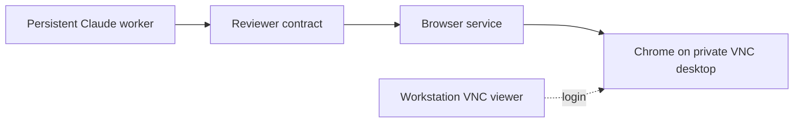
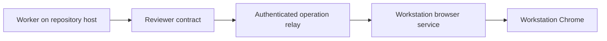
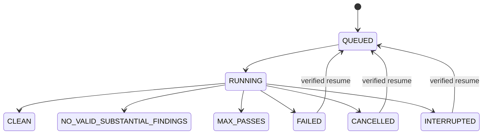

# Architecture

For setup and run control, see [Operations](OPERATIONS.md). For trust boundaries and publication restrictions, see [Security](../SECURITY.md).

## Components

| Module | Responsibility |
| --- | --- |
| `contracts.py` | Normalized requests, responses, health, reviewer and browser-session protocols |
| `worker.py` | Provider-neutral review loop |
| `reviewer.py` | Independent review semantics and prompts |
| `forge.py` | GitHub PR and GitLab MR targets: URL, push remote and review ref shapes |
| `browser/playwright.py` | ChatGPT selectors, page state, prompt readback, submission and completion rules |
| `browser/service.py` | Supervised driver process that owns Chrome and serves named operations over a private Unix socket |
| `backend.py` | Composition root; workflow prompts and worker logic do not branch on browser placement |
| `bridge/relay.py` | Named browser operations, with a workstation session lock across a whole review |
| `bridge/ssh.py` | Host-bound pairing over SSH and reverse forwarding |
| `mcp/server.py` | Stable package-owned stdio API for browser operations |
| `process.py` | Package-scoped supervision through systemd, tmux under a systemd scope, or launchd |

Configuration uses strict TOML/Pydantic. Schema 1 is the initial schema; unknown versions fail with an upgrade instruction rather than being rewritten. User settings are described in [Configuration](CONFIGURATION.md).

## Browser placement

In `host-browser` mode, the worker and browser run on the same host:



In `local-browser` mode, the browser service runs on the workstation:



The relay is reached through a loopback-only SSH reverse tunnel to the repository host; pairing checks that the SSH route reaches the host that issued the code. MCP exposes the browser contract to Claude Code; the worker calls the reviewer backend directly. Browser authentication and transport boundaries are detailed in [Security](../SECURITY.md).

## Worker lifecycle

The full review loop holds one cross-process reviewer lock and one repository lock. Each pass creates a fresh Temporary Chat in the same browser tab and persists the raw review before invoking Claude. The independent reviewer receives only the PR target, updated SHA and rubric, never earlier review findings.

Claude uses three restricted turns in one Claude session:

1. Read-only evaluation of findings against the repository and PR discussion.
2. Offline edits and checks, without Git metadata writes.
3. Staging and committing after verification permits publication.

LXReview validates the resulting commit and pushes it outside those turns. The [operations policy](OPERATIONS.md#review-decisions-and-verification) covers findings, baseline checks and final-pass behavior.



Resume verifies branch/remote identity and a clean, pushed HEAD. Incomplete pass evidence is archived before another independent pass. A durable cancellation marker wins over later worker state updates; observing a missing worker marks a nonterminal run interrupted.

## Hosts, storage and integration

Host identity prevents users of shared homes, such as LXPLUS nodes, from treating another node's services as local. Supervisor names include an installation-root hash to avoid collisions between installations. Sockets and service temporary files live in `/run/user/<uid>/lxreview-<hash>` when available, falling back to the installation's `run` directory; AFS homes cannot hold Unix sockets.

| Location | Contents |
| --- | --- |
| `~/.local/bin/lxreview` | Command installed by `uv tool install` |
| `~/.lxreview/bin/lxreview` | Fixed launcher written by `setup`: the tool environment's interpreter with this installation root |
| `~/.lxreview/state/runs/<id>/` | Run state, redacted events, worker output, Claude session ID and cancellation marker |
| `<git-common-dir>/review-loop/<id>/` | Run metadata, events, summary and per-pass evidence |
| `<git-common-dir>/review-loop/<id>/pass-NN/` | Verbatim review, explicit evaluations, PR discussion, diff, check reports and metadata |

Using the Git common directory keeps audit evidence out of commits and supports worktrees. Interrupted pass directories are retained with an `-interrupted-*` suffix. Events exclude hidden reasoning and redact credential-shaped values; raw reviews remain verbatim. See [Security](../SECURITY.md) before sharing artifacts.

Claude's user integration registers the MCP server and six slash commands pointing to the fixed launcher, so upgrading the package keeps them valid. Ownership records allow uninstall to remove only unchanged package-owned entries. Setup leaves shell startup files and PATH untouched.

During sandboxed commands, Claude Code creates empty, read-only placeholders for protected paths such as `.bashrc`, `.mcp.json` and `.claude/settings.json`. They disappear after the command, and LXReview excludes them from `git status` during the run. The full filesystem boundary is documented in [Security](../SECURITY.md).

## Development

From the source checkout:

```bash
uv sync --frozen
uv run pytest
uv run ruff check .
uv run ruff format --check .
uv run mypy src
uv build
uv tool install --managed-python --reinstall .   # use this checkout as the installed lxreview
```

Releases are published to PyPI by the `publish` workflow when a tag matching the package version (`v0.1.0`) is pushed. Playwright, mcp and aiohttp are pinned exactly in `pyproject.toml`, because an installed wheel does not use `uv.lock`.

The default test suite does not require a live browser or account login. See [third-party notices](../THIRD_PARTY.md) for runtime dependencies.
